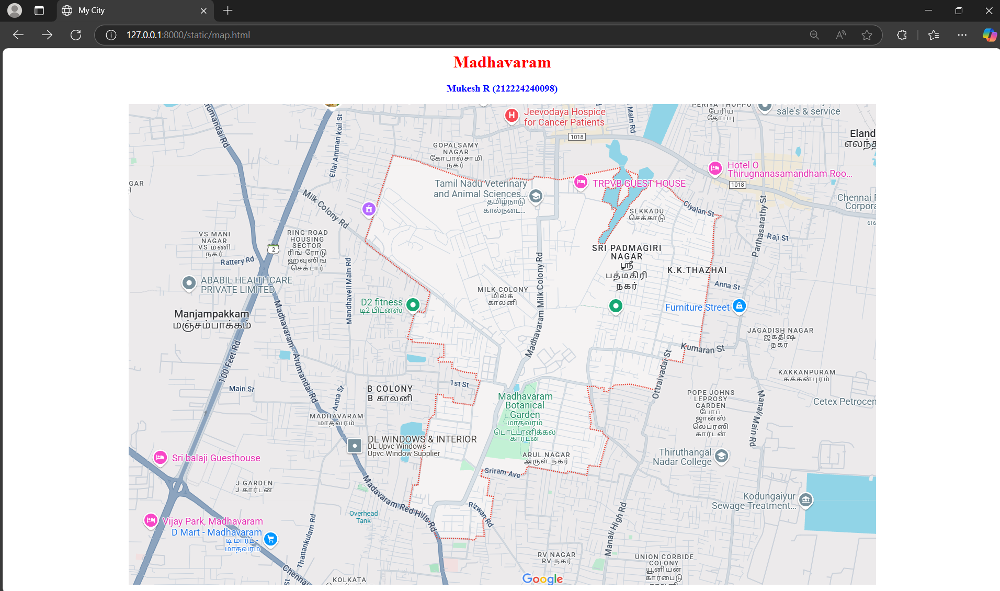
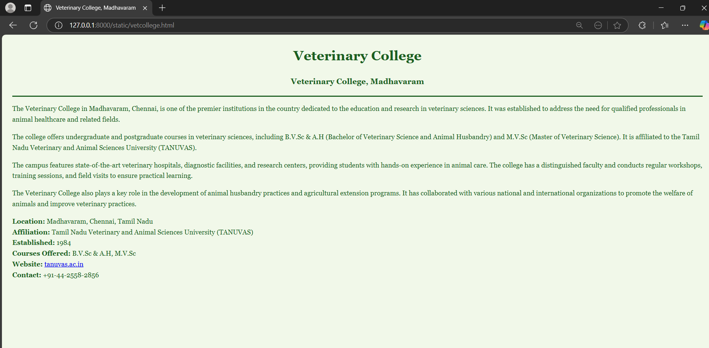
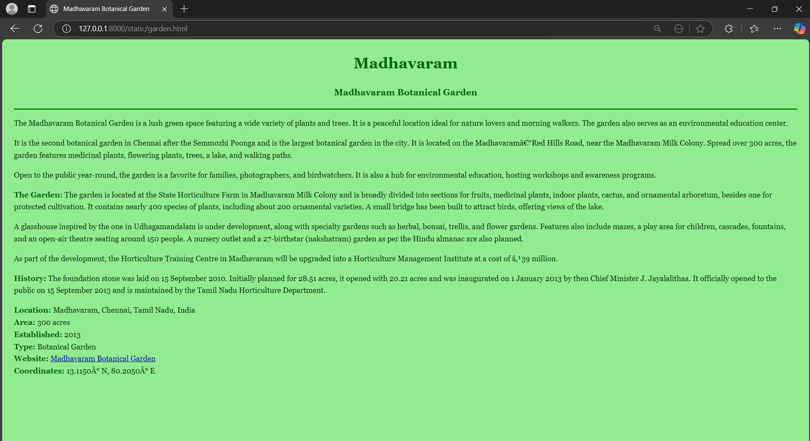
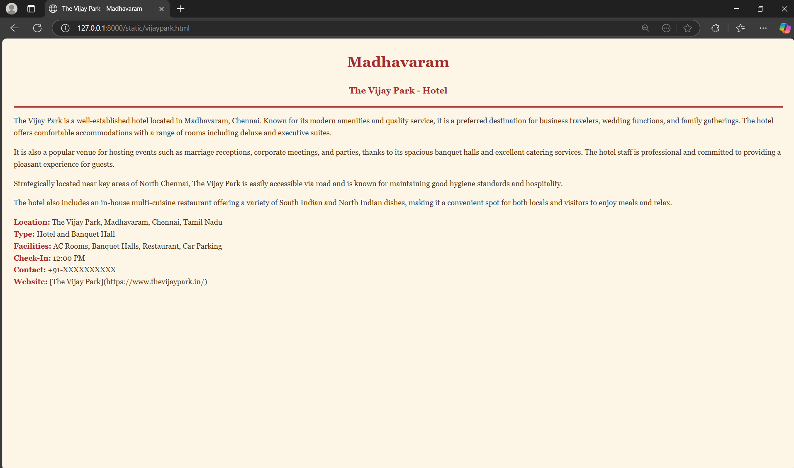
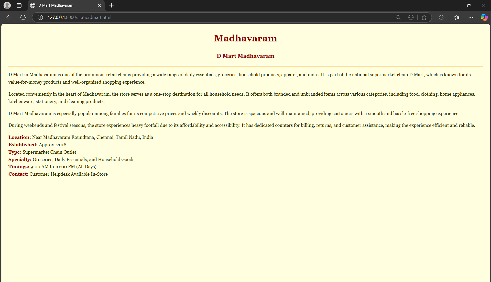
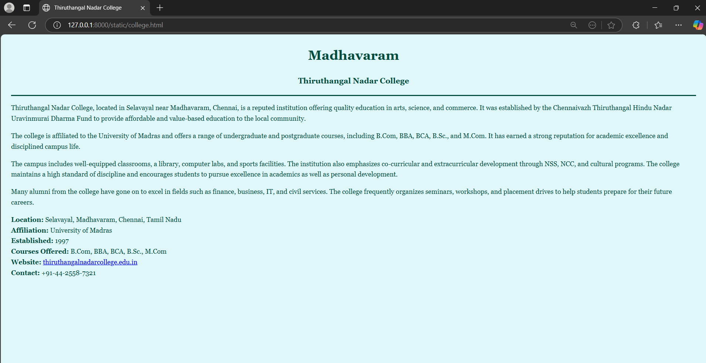
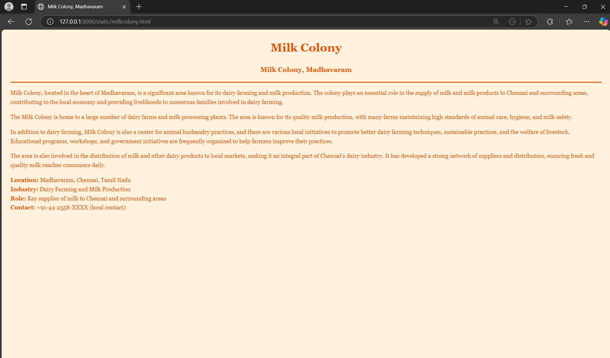

# Ex04 Places Around Me
## Date: 21-04-2025

## AIM
To develop a website to display details about the places around my house.

## DESIGN STEPS

### STEP 1
Create a Django admin interface.

### STEP 2
Download your city map from Google.

### STEP 3
Using ```<map>``` tag name the map.

### STEP 4
Create clickable regions in the image using ```<area>``` tag.

### STEP 5
Write HTML programs for all the regions identified.

### STEP 6
Execute the programs and publish them.

## CODE
```
map.html

<html>
    <head>
        <title>My City</title>
    </head>
    <body>
        <h1 align="center">
            <font color="red"><b>Madhavaram</b></font>
        </h1>
        <h3 align="center">
            <font color="blue"><b>Mukesh R (212224240098)</b></font>
        </h3>
        <center>
            
            <map name="MyCity">
                <area shape="rect" coords="968,592,1008,632" href="home.html" title="Home">
                <area shape="rect" coords="724,574,764,614" href="garden.html" title="Madhavaram Botanical Garden">
                <area shape="rect" coords="247,813,287,853" href="dmart.html" title="D Mart">
                <area shape="rect" coords="22,776,62,816" href="vijaypark.html" title="Vijay Park">
                <area shape="rect" coords="1108,655,1148,695" href="college.html" title="Thiruthangal Nadar College">
                <area shape="rect" coords="690,344,730,384" href="milkcolony.html" title="Milk Colony">
                <area shape="rect" coords="756,157,796,197" href="vetcollege.html" title="Veterinary College">

            </map>
        </center>
    </body>
</html>

```
---

```


garden.html

<html>
<head>
    <title>Madhavaram Botanical Garden</title>
    <style>
        body {
            background-color: lightgreen;
            font-family: Georgia, serif;
            font-size: 18px;
            color: #003300;
            line-height: 1.6;
            padding: 20px;
        }
        h1, h3 {
            text-align: center;
        }
        h1 {
            color: darkgreen;
        }
        h3 {
            color: green;
        }
        img {
            display: block;
            margin-left: auto;
            margin-right: auto;
            width: 70%;
            border: 3px solid green;
            border-radius: 15px;
        }
        b {
            color: darkgreen;
        }
    </style>
</head>
<body>
    <h1><b>Madhavaram</b></h1>
    <h3><b>Madhavaram Botanical Garden</b></h3>
    <hr size="3" color="green">


    <p>
        The Madhavaram Botanical Garden is a lush green space featuring a wide variety of plants and trees. It is a peaceful location ideal for nature lovers and morning walkers. The garden also serves as an environmental education center.
    </p>
    <p>
        It is the second botanical garden in Chennai after the Semmozhi Poonga and is the largest botanical garden in the city. It is located on the Madhavaram–Red Hills Road, near the Madhavaram Milk Colony. Spread over 300 acres, the garden features medicinal plants, flowering plants, trees, a lake, and walking paths.
    </p>
    <p>
        Open to the public year-round, the garden is a favorite for families, photographers, and birdwatchers. It is also a hub for environmental education, hosting workshops and awareness programs.
    </p>
    
    <p>
        <b>The Garden:</b> The garden is located at the State Horticulture Farm in Madhavaram Milk Colony and is broadly divided into sections for fruits, medicinal plants, indoor plants, cactus, and ornamental arboretum, besides one for protected cultivation. It contains nearly 400 species of plants, including about 200 ornamental varieties. A small bridge has been built to attract birds, offering views of the lake.
    </p>
    <p>
        A glasshouse inspired by the one in Udhagamandalam is under development, along with specialty gardens such as herbal, bonsai, trellis, and flower gardens. Features also include mazes, a play area for children, cascades, fountains, and an open-air theatre seating around 150 people. A nursery outlet and a 27-birthstar (nakshatram) garden as per the Hindu almanac are also planned.
    </p>
    <p>
        As part of the development, the Horticulture Training Centre in Madhavaram will be upgraded into a Horticulture Management Institute at a cost of ₹39 million.
    </p>

    <p>
        <b>History:</b> The foundation stone was laid on 15 September 2010. Initially planned for 28.51 acres, it opened with 20.21 acres and was inaugurated on 1 January 2013 by then Chief Minister J. Jayalalithaa. It officially opened to the public on 15 September 2013 and is maintained by the Tamil Nadu Horticulture Department.
    </p>

    <p>
        <b>Location:</b> Madhavaram, Chennai, Tamil Nadu, India<br>
        <b>Area:</b> 300 acres<br>
        <b>Established:</b> 2013<br>
        <b>Type:</b> Botanical Garden<br>
        <b>Website:</b> <a href="https://www.tnhorticulture.gov.in/" target="_blank">Madhavaram Botanical Garden</a><br>
        <b>Coordinates:</b> 13.1150° N, 80.2050° E
    </p>
</body>
</html>

```
---
```
vetcollege.html

<html>
<head>
    <title>Veterinary College, Madhavaram</title>
    <style>
        body {
            background-color: #f1f8e9;
            font-family: Georgia, serif;
            font-size: 18px;
            color: #1b5e20;
            line-height: 1.6;
            padding: 20px;
        }
        h1, h3 {
            text-align: center;
        }
        h1 {
            color: #2e7d32;
        }
        h3 {
            color: #388e3c;
        }
        b {
            color: #1b5e20;
        }
    </style>
</head>
<body>
    <h1><b>Veterinary College</b></h1>
    <h3><b>Veterinary College, Madhavaram</b></h3>
    <hr size="3" color="#1b5e20">

    <p>
        The Veterinary College in Madhavaram, Chennai, is one of the premier institutions in the country dedicated to the education and research in veterinary sciences. It was established to address the need for qualified professionals in animal healthcare and related fields.
    </p>
    <p>
        The college offers undergraduate and postgraduate courses in veterinary sciences, including B.V.Sc & A.H (Bachelor of Veterinary Science and Animal Husbandry) and M.V.Sc (Master of Veterinary Science). It is affiliated to the Tamil Nadu Veterinary and Animal Sciences University (TANUVAS).
    </p>
    <p>
        The campus features state-of-the-art veterinary hospitals, diagnostic facilities, and research centers, providing students with hands-on experience in animal care. The college has a distinguished faculty and conducts regular workshops, training sessions, and field visits to ensure practical learning.
    </p>
    <p>
        The Veterinary College also plays a key role in the development of animal husbandry practices and agricultural extension programs. It has collaborated with various national and international organizations to promote the welfare of animals and improve veterinary practices.
    </p>
    <p>
        <b>Location:</b> Madhavaram, Chennai, Tamil Nadu<br>
        <b>Affiliation:</b> Tamil Nadu Veterinary and Animal Sciences University (TANUVAS)<br>
        <b>Established:</b> 1984<br>
        <b>Courses Offered:</b> B.V.Sc & A.H, M.V.Sc<br>
        <b>Website:</b> <a href="http://www.tanuvas.ac.in">tanuvas.ac.in</a><br>
        <b>Contact:</b> +91-44-2558-2856<br>
    </p>
</body>
</html>
```
---
```
 college.html

 <html>
<head>
    <title>Thiruthangal Nadar College</title>
    <style>
        body {
            background-color: #e0f7fa;
            font-family: Georgia, serif;
            font-size: 18px;
            color: #004d40;
            line-height: 1.6;
            padding: 20px;
        }
        h1, h3 {
            text-align: center;
        }
        h1 {
            color: #00695c;
        }
        h3 {
            color: #00796b;
        }
        b {
            color: #004d40;
        }
    </style>
</head>
<body>
    <h1><b>Madhavaram</b></h1>
    <h3><b>Thiruthangal Nadar College</b></h3>
    <hr size="3" color="#004d40">

    <p>
        Thiruthangal Nadar College, located in Selavayal near Madhavaram, Chennai, is a reputed institution offering quality education in arts, science, and commerce. It was established by the Chennaivazh Thiruthangal Hindu Nadar Uravinmurai Dharma Fund to provide affordable and value-based education to the local community.
    </p>
    <p>
        The college is affiliated to the University of Madras and offers a range of undergraduate and postgraduate courses, including B.Com, BBA, BCA, B.Sc., and M.Com. It has earned a strong reputation for academic excellence and disciplined campus life.
    </p>
    <p>
        The campus includes well-equipped classrooms, a library, computer labs, and sports facilities. The institution also emphasizes co-curricular and extracurricular development through NSS, NCC, and cultural programs. The college maintains a high standard of discipline and encourages students to pursue excellence in academics as well as personal development.
    </p>
    <p>
        Many alumni from the college have gone on to excel in fields such as finance, business, IT, and civil services. The college frequently organizes seminars, workshops, and placement drives to help students prepare for their future careers.
    </p>
    <p>
        <b>Location:</b> Selavayal, Madhavaram, Chennai, Tamil Nadu<br>
        <b>Affiliation:</b> University of Madras<br>
        <b>Established:</b> 1997<br>
        <b>Courses Offered:</b> B.Com, BBA, BCA, B.Sc., M.Com<br>
        <b>Website:</b> <a href="https://www.thiruthangalnadarcollege.edu.in/">thiruthangalnadarcollege.edu.in</a><br>
        <b>Contact:</b> +91-44-2558-7321<br>
    </p>
</body>
</html>
```
---
```
dmart.html

<html>
<head>
    <title>D Mart Madhavaram</title>
    <style>
        body {
            background-color: lightyellow;
            font-family: Georgia, serif;
            font-size: 18px;
            color: #333300;
            line-height: 1.6;
            padding: 20px;
        }
        h1, h3 {
            text-align: center;
        }
        h1 {
            color: darkorange;
        }
        h3 {
            color: orangered;
        }
        b {
            color: darkred;
        }
    </style>
</head>
<body>
    <h1><b>Madhavaram</b></h1>
    <h3><b>D Mart Madhavaram</b></h3>
    <hr size="3" color="orange">

    <p>
        D Mart in Madhavaram is one of the prominent retail chains providing a wide range of daily essentials, groceries, household products, apparel, and more. It is part of the national supermarket chain D Mart, which is known for its value-for-money products and well-organized shopping experience.
    </p>
    <p>
        Located conveniently in the heart of Madhavaram, the store serves as a one-stop destination for all household needs. It offers both branded and unbranded items across various categories, including food, clothing, home appliances, kitchenware, stationery, and cleaning products.
    </p>
    <p>
        D Mart Madhavaram is especially popular among families for its competitive prices and weekly discounts. The store is spacious and well-maintained, providing customers with a smooth and hassle-free shopping experience.
    </p>
    <p>
        During weekends and festival seasons, the store experiences heavy footfall due to its affordability and accessibility. It has dedicated counters for billing, returns, and customer assistance, making the experience efficient and reliable.
    </p>
    <p>
        <b>Location:</b> Near Madhavaram Roundtana, Chennai, Tamil Nadu, India<br>
        <b>Established:</b> Approx. 2018<br>
        <b>Type:</b> Supermarket Chain Outlet<br>
        <b>Specialty:</b> Groceries, Daily Essentials, and Household Goods<br>
        <b>Timings:</b> 9:00 AM to 10:00 PM (All Days)<br>
        <b>Contact:</b> Customer Helpdesk Available In-Store<br>
    </p>
</body>
</html>
```
---
```
milkcolony.html

<html>
<head>
    <title>Milk Colony, Madhavaram</title>
    <style>
        body {
            background-color: #fff3e0;
            font-family: Georgia, serif;
            font-size: 18px;
            color: #e65100;
            line-height: 1.6;
            padding: 20px;
        }
        h1, h3 {
            text-align: center;
        }
        h1 {
            color: #f57c00;
        }
        h3 {
            color: #fb8c00;
        }
        b {
            color: #e65100;
        }
    </style>
</head>
<body>
    <h1><b>Milk Colony</b></h1>
    <h3><b>Milk Colony, Madhavaram</b></h3>
    <hr size="3" color="#e65100">

    <p>
        Milk Colony, located in the heart of Madhavaram, is a significant area known for its dairy farming and milk production. The colony plays an essential role in the supply of milk and milk products to Chennai and surrounding areas, contributing to the local economy and providing livelihoods to numerous families involved in dairy farming.
    </p>
    <p>
        The Milk Colony is home to a large number of dairy farms and milk processing plants. The area is known for its quality milk production, with many farms maintaining high standards of animal care, hygiene, and milk safety.
    </p>
    <p>
        In addition to dairy farming, Milk Colony is also a center for animal husbandry practices, and there are various local initiatives to promote better dairy farming techniques, sustainable practices, and the welfare of livestock. Educational programs, workshops, and government initiatives are frequently organized to help farmers improve their practices.
    </p>
    <p>
        The area is also involved in the distribution of milk and other dairy products to local markets, making it an integral part of Chennai's dairy industry. It has developed a strong network of suppliers and distributors, ensuring fresh and quality milk reaches consumers daily.
    </p>
    <p>
        <b>Location:</b> Madhavaram, Chennai, Tamil Nadu<br>
        <b>Industry:</b> Dairy Farming and Milk Production<br>
        <b>Role:</b> Key supplier of milk to Chennai and surrounding areas<br>
        <b>Contact:</b> +91-44-2558-XXXX (local contact)<br>
    </p>
</body>
</html>
```
---
```
vijaypark.html

<html>
<head>
    <title>The Vijay Park - Madhavaram</title>
    <style>
        body {
            background-color: #fdf5e6;
            font-family: Georgia, serif;
            font-size: 18px;
            color: #4b3621;
            line-height: 1.6;
            padding: 20px;
        }
        h1, h3 {
            text-align: center;
        }
        h1 {
            color: darkred;
        }
        h3 {
            color: maroon;
        }
        b {
            color: brown;
        }
    </style>
</head>
<body>
    <h1><b>Madhavaram</b></h1>
    <h3><b>The Vijay Park - Hotel</b></h3>
    <hr size="3" color="brown">

    <p>
        The Vijay Park is a well-established hotel located in Madhavaram, Chennai. Known for its modern amenities and quality service, it is a preferred destination for business travelers, wedding functions, and family gatherings. The hotel offers comfortable accommodations with a range of rooms including deluxe and executive suites.
    </p>
    <p>
        It is also a popular venue for hosting events such as marriage receptions, corporate meetings, and parties, thanks to its spacious banquet halls and excellent catering services. The hotel staff is professional and committed to providing a pleasant experience for guests.
    </p>
    <p>
        Strategically located near key areas of North Chennai, The Vijay Park is easily accessible via road and is known for maintaining good hygiene standards and hospitality.
    </p>
    <p>
        The hotel also includes an in-house multi-cuisine restaurant offering a variety of South Indian and North Indian dishes, making it a convenient spot for both locals and visitors to enjoy meals and relax.
    </p>
    <p>
        <b>Location:</b> The Vijay Park, Madhavaram, Chennai, Tamil Nadu<br>
        <b>Type:</b> Hotel and Banquet Hall<br>
        <b>Facilities:</b> AC Rooms, Banquet Halls, Restaurant, Car Parking<br>
        <b>Check-In:</b> 12:00 PM<br>
        <b>Contact:</b> +91-XXXXXXXXXX<br>
        <b>Website:</b> [The Vijay Park](https://www.thevijaypark.in/)<br>
    </p>
</body>
</html>
```

## OUTPUT









## RESULT
The program for implementing image maps using HTML is executed successfully.
